# API V2

## Introduction

Unitag provides a simple yet powerful REST API to integrate the generation of QR Codes in your application

## General

### Data Centers

Our services are hosted in Amazon Ireland (eu-west-1) and OVH France

### Sandbox

A public sandbox is available for testing the generation of QR Codes. In this environment you are limited to 1000 calls per day, if additional operations are needed please contact our support. In addition, any QR Code created will be deleted after 6 months, upon scanning they will return an HTTP 404 from our resolvers.

Those limitations reset every day at midnight (00:00am) GMT

#### Sandbox URLs

When testing your API connectivity make sure to use the following URLs:

REST API  

https://api-v2.sandbox.unitag.io

## Content

* [QR codes](#qr-codes)
  * [Preview a QR code](#preview-a-qr-code-design)
  * [Create a QR code](#create-a-qr-code)
  * [Get and add a QR code template](#retrieve-qr-code-templates)
  * [Download a QR code](#download-a-qr-code)
  * [Retrieve a QR code](#retrieve-a-qr-code)
  * [Retrieve all QR codes](#retrieve-all-qr-codes)
  * [Update a QR code URL](#update-a-qr-code-destination-url)
* [Filters](#filters)
  * [Create a Filter](#create-a-filter)
  * [Retrieve all Filters](#retrieve-filters-for-a-qr-code)
* [Domain names](#domain-names)
  * [Register a Domain](#register-a-domain-name)
  * [Validate a Domain](#validate-a-domain-name)
  * [Retrieve domains](#list-all-domain-names-available)
* [Analytics](#analytics)
  * [Retrieve QR Codes statistics](#retrieve-qr-codes-aggregated-stats)

## API

The REST API endpoints are as follows:

REST API  

https://api-v2.unitag.io

### Requests

All requests and responses of *Content-Type* *application/json* and follow typical HTTP response status codes for success and failures

#### Errors

Unless otherwise stated, errors to bad requests will respond with HTTP 4xx or status codes. The body will also contain a message parameter indicating the cause.

| Status Code | Reason |
| --- | --- |
| 400 | Bad Request - Invalid request format |
| 401 | Unauthorized - Bad API key |
| 403 | Forbidden - Insufficient rights or credits to perform the operation |
| 404 | Not found - The resource cannot be found for the user |
| 500 | Internal error - Please contact our support |

#### Successes

A successful response is indicated by HTTP status code 200 and may contain an optional body. If the response has a body it will be documented under each resource below.

### Types

#### IDs

Most identifiers are UUID unless otherwise specified. When making a request which requires a UUID. Those UUIDs are based on RFC 4122 and DCE 1.1: Authentication and Security Services.

Example: *f81d4fae-7dec-11d0-a765-00a0c91e6bf6*

## Rate Limits

When a rate limit is exceeded, a status of *429 Too Many Requests* will be returned.

### Sandbox

1000 calls a day

### Production

1000000 calls a day

Each of those counters are reset every day at midnight (00:00am GMT)

## Authentication

### Generating an API Key

You can generate an API key from https://console.sandbox.unitag.io/settings section API.
In case of issue, please contact our Support Team (via the support button in your dashboard) in order to gain access to it and receive your credentials.

You can then call Unitag API endpoints by adding your API key as a header to the request such as:

```X-Unitag-ApiKey=<API-Key>```

### Environments

Upon creating your key you will have to choose the targeted environment accordingly. Environments are isolated, meaning that any asset created in one will not be duplicated or accessible to/from another environment.

## QR Codes

### Preview a QR Code design

Create a QR Code Preview for the profile of the API Key

**HTTP request**

`POST /qrcode/preview`

**Request fields**

Example:
```json
{
  "data": {
    "type": "URL",
    "resolution": "dynamic",
    "url": "https://unitag.io"
  },
  "settings": {
    "template_id": "",
    "redundancy": "M",
    "eyes": {
      "type": "curved",
      "color_ext_top_left": "",
      "color_ext_top_right": "",
      "color_ext_bottom_left": "",
      "color_int_bottom_left": "",
      "color_int_top_right": "",
      "color_int_top_left": ""
    },
    "layout": {
      "gradient_type": "vertical",
      "type": "gradient",
      "color_background": "#ffffff",
      "color_one": "#53c1a6",
      "color_two": "#c9285a",
      "color_shadow": "#bdbdbd",
      "force_shadow": "none"
    },
    "logo": {
      "excavate": false,
      "url": "",
      "width": 0,
      "x": 0,
      "x_norm": 0,
      "y": 0,
      "y_norm": 0
    },
    "background": {
      "url": "",
      "contrast": 0,
      "brightness": 0
    },
    "modules": {
      "type": "simple"
    }
  }
}
```

**Details**

*Data* object:

| field | type | mandatory | description |  
| --- | --- | --- | --- |  
| type | string | true | Type of QR Code, one of "url, vcard" |  
| resolution | string | true | Resoluton of your QR Code, one of "dynamic, dynamic-pro, static" 
| url | string | true | Final URL to which your QR Code should redirect to upon scanning |

*Settings* object:

- *Layout* object:

| field | type | mandatory | description |  
| --- | --- | --- | --- |  
| type | string | true | One of "single_color, gradient, image_overlay" |
| color_one | string | false | Hexadecimal representation of any color used to fill the QR Code eyes and modules |
| color_background | string | false | Hexadecimal representation of any color used to fill the background |

- *Eyes* object:

| field | type | mandatory | description |  
| --- | --- | --- | --- |  
| type | string | false | Type of Eye, one of "simple, diamond, rounded, rounded_light, rounded_strong, eye_right, eye_left, shield, pillow, star, leaf, sieve, dots, wave, sharp, curved, tik_tak_toe, octagonal, alien, grid"

Please read the table below which illustrates the different options:

| Eye type | Representation |
| --- | --- |
| simple |  |
| diamond |  |
| rounded |  |
| rounded_light |  |
| rounded_strong |  |
| eye_right |  |
| eye_left |  |
| shield |  |
| pillow |  |
| star |  |
| leaf |  |
| sieve |  |
| dots |  |
| wave | 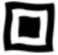 |
| sharp | 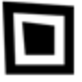 |
| curved |  |
| tik_tak_toe | 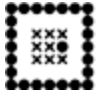 |
| octagonal | 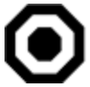 |
| alien | 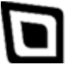 |
| grid |  |

- *Modules* object:

| field | type | mandatory | description |  
| --- | --- | --- | --- |
| type | string | false | Type of Module, one of "simple, rounded, rounded_light, rounded_strong, sieve, angular, paint, dots, arrows, styled, rectangles, tik_tak_toe, connections, shinny" |

Please read the table below which illustrates the different options:

| Module type | Representation |
| --- | --- |
| simple | 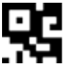 |
| rounded | 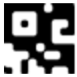 |
| rounded_light | 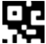 |
| rounded_strong |  |
| sieve | 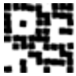 |
| angular | 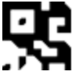 |
| paint | 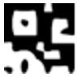 |
| dots | 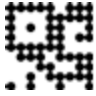 |
| arrows | 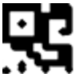 |
| styled | 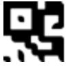 |
| rectangles | 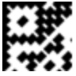 |
| tik_tak_toe | 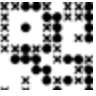 |
| connections | 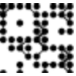 |
| shinny | 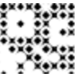 |

- *Background* object:

> Attention:   
> The overlay will apply an image on your QR Code, we recommend using a 300px by 300px image with a sufficient contrast against your background color or your QR Code my not be readable by native scanners

| field | type | mandatory | description |  
| --- | --- | --- | --- |
| url | string | false | The URL of your remote asset to use as overlay |
| brightness | float | false | From 0.0 to 1.0 (default 0.5), brightness will be applied on your asset |
| contrast | float | false | From 0.0 to 1.0 (default 0.5), contrast that will be applied on your asset |

- *Logo* object:

> Attention:  
> A logo is an image present in your QR Code that hides some information, thanks to our QR Code redundancy it should have no effect on the QR Code readability. But, a logo too big or misplaced can render your QR Code unreadable

| field | type | mandatory | description |  
| --- | --- | --- | --- |
| excavate | boolean | false | (default: false) To excavate or not the logo in the QR Code |
| x | number | false | Absolute origin position  in pixels on the x axis in the QR Code |
| y | number | false | Absolute origin position in pixels on the y axis in the QR Code |
| width | number | false | Width in pixels of your logo |
| url | string | false | The URL of your remote asset to use as logo |

**Response**

Content-Type: image/png

The preview image of the resulted QR Code

---
### Create a QR Code

Create a QR Code Preview for the profile of the API Key

**HTTP request**

`POST /qrcode`

**Request fields**

Example
```json
{
  "data": {
    "type": "url",
    "resolution": "dynamic",
    "url": "https://example.com/my-page",
    "label": "My first QR code"
  },
  "settings": {
    "layout": {
      "gradient_type": "",
      "type": "image_overlay",
      "color_background": "#ffffff",
      "force_shadow": "none"
    },
    "eyes": {
      "type": "simple"
    },
    "modules": {
      "type": "simple"
    },
    "background": {
      "url": "https://example.com/my-asset.png",
      "brightness": 0.5,
      "contrast": 0.5
    },
    "logo": {
      "excavate": false,
      "x": 0,
      "y": 0,
      "width": 20,
      "url": "https://example.com/my-logo.png"
    }
  }
}
```

Example of data payload with Dynamic Pro

```json
{
  "data": {
    "type": "url",
    "resolution": "dynamic-pro",
    "domain_id": "f81d4fae-7dec-11d0-a765-00a0c91e6bf6",
    "url": "https://example.com/my-page",
    "[...]": "[...]"
  }
}
```

**Details**

*Data* object:

| field      | type | mandatory | description                                                     |  
|------------| --- | --- |-----------------------------------------------------------------|  
| type       | string | true | Type of QR Code, one of "url, vcard"                            |  
| resolution | string | true | Resoluton of your QR Code, one of "dynamic, dynamic-pro, static" |
| domain_id  | string | true | Mandatory if resolution type is "dynamic-pro"                   | 
| url        | string | true | Final URL to which your QR Code should redirect to upon scanning |
| label      | string | false | Name for your QR code                                           |

*Settings* object:

For more details about the settings object please refer to the *Settings* object in the **QRCode Preview** section

**Response fields**

Example

```json
{
  "status": "created",
  "qrcode_id": "f81d4fae-7dec-11d0-a765-00a0c91e6bf6",
  "content_url": "https://qrcode.link/a/f81d4fae-7dec-11d0-a765-00a0c91e6bf6",
  "qr_code_image_url": "https://cdn-public.unitag.io/aaaaaaa-7dec-11d0-a765-00a0c91e6bf6/f81d4fae-7dec-11d0-a765-00a0c91e6bf6.png"
}
```

| field | type | description                                                                |
| --- | --- |----------------------------------------------------------------------------|
| status | string | Status of the QR Code, one of "created, updated"                           |
| qrcode_id | string | ID of the QR Code created                                                  |
| content_url | string | Resolution URL, your own domain name if resolution is set to "dynamic-pro" |
| qr_code_image_url | string | QR Code image available from our CDN                                       |

---

### Retrieve QR Code templates

To retrieve the list of existing template:

**HTTP request**

```
GET /qrcodes/templates
```

When creating a QR code using a template design, pass the UUID of the template to the POST create QR Code request

```json
{
    "settings": {
        ...
        "redundancy": "H",
        "template_id": "c7a5dc7c-4bcb-435d-a5a3-b21658189f7a"
    },
    "data": {
        ...
    }
}
```

### Download a QR Code

Download a QR Code in multiple formats

**HTTP request**

```
POST /asset/download/qrcode_bundle
```

**Request fields**

Example single download

```json
{
  "asset_uuid": "<qrcode_id>",
  "format": "png",
  "size": 300,
  "unit": "px"
}
```

### Download multiple QR Codes

```
POST /asset/download/export
```

Example batch download

```json
{
  "qrcode_ids": ["<qrcode_id_1>", "<qrcode_id_2>", "<qrcode_id_3>"],
  "format": "png",
  "size": 300,
  "unit": "px"
}
```

*Data* object

| field      | type            | mandatory                 | description                |  
|------------|-----------------|---------------------------|----------------------------|  
| asset_uuid | string          | true (if single download) | Asset ID to be downloaded  |
| qrcode_ids | Array of string | true (if batch download)  | Assets ID to be downloaded |
| format | string | true | Desired output format, one of "png", "svg", "jpeg", "pdf" |
| size | number | true | Desired output size, range between 100 and 1500 |
| unit | string | true | Desire output unit, one of "px", "mm" |

**Response**

If a single download has been created, you will receive a binary output matching your request representing the image of your asset

If a batch download has been created, you will obtain a compressed archive, a zip file containing all your assets

---

### Retrieve a QR Code

Retrieve a QR Code via its ID

**HTTP request**

```GET /qrcode/<qrcode_id>```

---

### Retrieve all QR Codes

Retrieve all QR Codes associated with the account

**HTTP request**

```GET /qrcodes```

---

### Update a QR Code destination URL

Update the destination URL of a QR Code

> This request is only available for Dynamic and Dynamic Pro QR Codes

**HTTP request**

```PUT /qrcode/<qrcode_id>/url```

**Request fields**

Example 

```json
{
  "url": "https://unitag.io/features"
}
```

*Data* object:

| field | type | mandatory | description |  
| --- | --- | --- | --- |  
| url | string | true | The final URL of your QR Code |

---

## Filters

> NB: Filters are only available for Dynamic and Dynamic Pro QR Codes

Filters are a way to redirect your users based on certain conditions. Those conditions are evaluated upon scanning a QR Code. If those conditions are fulfilled the filter will be triggered

Filters available:
* Language based
* Device based
* Location based (module required)
* Time based (module required)
* Combination of all the above

### Create a Filter

**HTTP request**

```POST /qrcode/<qrcode_id>/filter```

**Request fields**

Example

In this example we are creating a language filter which is read as followed:
If an english speaker scans this QR Code it will be redirected to https://www.unitag.io/welcome

```json
{
  "final_url": "https://www.unitag.io/welcome",
  "statements": [
    {
      "type": "language",
      "value": "en"
    }
  ]
}
```

**Details**

*Filter* object:

| field      | type               | mandatory | description                                                     |  
|------------|--------------------| --- |-----------------------------------------------------------------|  
| final_url  | string             | true | The destination URL used if the filter statements are fulfilled |
| statements | Array of Statement | true | List of Statements for the filter                               | 

*Statement* object:

| field | type | mandatory | description                                                                            |  
|-------| --- | --- |----------------------------------------------------------------------------------------|  
| type  | string | true | Type of Statement, one of "device, language, location_country, location_precise, time" |  
| value | string | true | Refer to next paragraph for formats specifications |                       

**Statement values format**

*device type Statement*

Supported values: "blackberry", "iphone", "ipad", "windows_phone",
"windows_tablet", "windows_computer", "apple_computer", "android_phone", "android_tablet"

```json
{
  "type": "device",
  "value": "iphone"
}
```

*language type Statement*

Supported values: Any Alpha-2 code part of ISO 639 -- [Wikipedia Source](https://en.wikipedia.org/wiki/ISO_639-1)

```json
{
  "type": "language",
  "value": "en"
}
```

*location_country type Statement*

Supported values: Any Alpha-2 code part of ISO 3166 -- [ISO Search](https://www.iso.org/obp/ui/#search/code/)

```json
{
  "type": "language",
  "value": "US"
}
```

---

### Retrieve filters for a QR Code

**HTTP request**

```GET /qrcode/<qrcode_id>/filters```

---

## Domain Names

Domain names allows to use your own domain name in your QR code for Dynamic Pro QR codes

> NB: Custom domain names are available from Gold subscription and upwards

### Register a domain name

Registering a domain name is the first operation in order to use your custom domain name with Unitag Resolver engine

Supported domain names examples:
* APEX (eg: example.org)
* SUBDOMAIN (eg: **qr**.example.org, **www**.example.org, **foo**.example.org)

**Request**

```POST /domains```

Example

```json
{
  "domain_name": "example.org"
}
```

*Data* object:

| field | type | mandatory | description |  
| --- | --- | --- | --- |  
| domain_name | string | true | Domain name that you want to register with us|


**Response**

```json
{
  "type": "APEX",
  "requested_domain": "example.org",
  "domain_uuid": "f81d4fae-7dec-11d0-a765-00a0c91e6bf6",
  "fqdn": "f81d4fae-7dec-11d0-a765-00a0c91e6bf6.qrcode.link",
  "ip": "1.2.3.4"
}
```

*Data* object:

| field | type  | description |  
| --- | --- | --- |  
| type | string | Either APEX or SUBDOMAIN based on the given domain |
| requested_domain | string | The domain you have submitted |
| domain_uuid | string | The UUID of your domain |
| fqdn | string | If SUBDOMAIN - Fully Qualified Domain Name - For registration purposes |
| ip | string | If APEX - IP address - For registration purposes |

Once you have received the response from the API you need to update your domain name with your registrar

If your domain name is an APEX you will need to create an A record such as:  
```example.org A 1.2.3.4```

If your domain name is a SUBDOMAIN you will need to create a CNAME record such as:   
```foo.example.org CNAME f81d4fae-7dec-11d0-a765-00a0c91e6bf6.qrcode.link.```

> NB: If you are registering a SUBDOMAIN please make sure to add a dot (.) at the end of the CNAME entry

---

### Validate a domain name

Once your domain has been registered with us you need to update your domain with your registrar (eg: Gandi, Google, OVH). Once done you will be able to finalize the registration of your domain by validating your configuration against our API

**Request**

```GET /domains/<domain_id>/check```

**Response**

HTTP code 200

```json
{
  "domain_uuid": "f81d4fae-7dec-11d0-a765-00a0c91e6bf6"
}
```

HTTP code 409

```json
{
  "message": "The current entry does not resolves to a Unitag domain name, please make sure your DNS zone is correctly configured"
}
```

---

### List all domain names available

Retrieve the list of domain available for the account

**Request**

```GET /domains```

**Response**

HTTP code 200

NB: As an owner of a domain name more fields might be added if you have shared the domain across accounts

```json
[
  {
    "domain_id": "f81d4fae-7dec-11d0-a765-00a0c91e6bf6",
    "domain_name": "example.org",
    "ssl_activated": true,
    "activated": true,
    "status": ""
  }  
]
```

*Data* []object:

| field         | type  | description                    |  
|---------------| --- |--------------------------------|  
| domain_id     | string | The ID of the domain           |
| domain_name   | string | The domain name as string      |
| ssl_activated | string | Status of the SSL service      |
| activated     | string | Status of the domain name      |
| status        | string | Used for deactivation purposes |

---

## Analytics

The Analytics endpoint allows you to retrieve stats generated by your QR Codes

### Retrieve QR codes aggregated stats

Unitag pre aggregates data in order to offload calculations for you

**Request**

```POST /analytics/qrcodes/search```

Example

The following query reads as:
* Get all stats from 2 weeks ago to now (type: 1 relate to a relative time search )

```json
{
  "time_range": {
    "type": 1,
    "number": 2,
    "unit": "weeks"
  }
}
```

* Get all stats for an absolute date range (type 0)

```json
{
  "time_range": {
    "type": 0,
    "start_date": "2022-07-31T23:00:00.000Z",
    "end_date": "2022-09-01T23:00:00.000Z"
  }
}
```

*Data* object:

| field | type | mandatory | description |  
| --- | --- | --- | --- |  
| time_range.number | number | false | Time observed (number) |
| time_range.unit | string | false | Time observed (units) - one of: minutes, hours, days, weeks, months |


**Response**
```json
{
  "histogram": [
    {
      "date": 1635984000000,
      "count": 0
    },
    {
      "date": 1636070400000,
      "count": 0
    },
    {
      ...
    }
    {
      "date": 1637193600000,
      "count": 1
    }
  ],
  "visits_count": 1,
  "visits_count_comparison": 0,
  "unique_visitors_count": 1,
  "unique_visitors_count_comparison": 0,
  "countries_histogram": [
    {
      "country_iso": "GB",
      "count": 1
    }
  ],
  "visits_history": {
    "cursor_id": "",
    "visits": [
      {
        "date": 1637251153589,
        "label": "My QR code",
        "country_iso": "GB",
        "model": "iPhone"
      }
    ]
  }
}
```


