# API V2

## Introduction

Unitag provides a simple yet powerful REST API to integrate the generation of QR Codes in your application

## General

### Data Centers

Our services are hosted in Amazon Ireland (eu-west-1) and OVH France

### Sandbox

A public sandbox is available for testing the generation of QR Codes. In this environment you are limited to 1000 calls per day, if additional operations are needed please contact our support. In addition, any QR Code created will be deleted after 6 months, upon scanning they will return an HTTP 404 from our resolvers.

Those limitations reset every day at midnight (00:00am) GMT

#### Sandbox URLs

When testing your API connectivity make sure to use the following URLs:

REST API  

https://api-v2.sandbox.unitag.io

## Content

* [QR codes](#qr-codes)
  * [Preview a QR code](#preview-a-qr-code-design)
  * [Create a QR code](#create-a-qr-code)
  * [Retrieve a QR code](#retrieve-a-qr-code)
  * [Retrieve all QR codes](#retrieve-all-qr-codes)
  * [Update a QR code URL](#update-a-qr-code-destination-url)
  * [Update a QR code label](#update-a-qr-code-label)
  * [Delete a QR code](#delete-a-qr-code)
  * [Download a QR code](#download-a-qr-code)
  * [Download multiple QR codes](#download-multiple-qr-codes)
* [Templates](#templates)
  * [Retrieve templates](#retrieve-qr-code-templates)
  * [Create a template](#create-a-template-from-a-qr-code)
  * [Update a template](#update-a-template)
  * [Delete a template](#delete-a-template)
* [Filters](#filters)
  * [Create a filter](#create-a-filter)
  * [Retrieve filters](#retrieve-filters-for-a-qr-code)
  * [Update a filter](#update-a-filter)
  * [Delete a filter](#delete-a-filter)
* [Domain names](#domain-names)
  * [Register a domain](#register-a-domain-name)
  * [Validate a domain](#validate-a-domain-name)
  * [Retrieve domains](#list-all-domain-names-available)
* [Campaigns](#campaigns)
  * [List campaigns](#list-campaigns)
  * [Create a campaign](#create-a-campaign)
  * [Create a sub-campaign](#create-a-sub-campaign)
  * [Update a campaign](#update-a-campaign)
  * [Get campaign assets count](#get-campaign-assets-count)
  * [Delete a campaign](#delete-a-campaign)
* [Analytics](#analytics)
  * [Retrieve aggregated stats](#retrieve-qr-codes-aggregated-stats)
  * [Retrieve visit records](#retrieve-visit-records)
  * [Export analytics](#export-analytics)

## API

The REST API endpoints are as follows:

REST API  

https://api-v2.unitag.io

### Requests

All requests and responses of *Content-Type* *application/json* and follow typical HTTP response status codes for success and failures

#### Errors

Unless otherwise stated, errors to bad requests will respond with HTTP 4xx or status codes. The body will also contain a message parameter indicating the cause.

| Status Code | Reason |
| --- | --- |
| 400 | Bad Request - Invalid request format |
| 401 | Unauthorized - Bad API key |
| 403 | Forbidden - Insufficient rights or credits to perform the operation |
| 404 | Not found - The resource cannot be found for the user |
| 500 | Internal error - Please contact our support |

#### Successes

A successful response is indicated by HTTP status code 200 and may contain an optional body. If the response has a body it will be documented under each resource below.

### Types

#### IDs

Most identifiers are UUID unless otherwise specified. When making a request which requires a UUID. Those UUIDs are based on RFC 4122 and DCE 1.1: Authentication and Security Services.

Example: *f81d4fae-7dec-11d0-a765-00a0c91e6bf6*

## Rate Limits

When a rate limit is exceeded, a status of *429 Too Many Requests* will be returned.

### Sandbox

1000 calls a day

### Production

1000000 calls a day

Each of those counters are reset every day at midnight (00:00am GMT)

## Authentication

### Generating an API Key

You can generate an API key from https://console.sandbox.unitag.io/settings section API.
In case of issue, please contact our Support Team (via the support button in your dashboard) in order to gain access to it and receive your credentials.

You can then call Unitag API endpoints by adding your API key as a header to the request such as:

```X-Unitag-ApiKey=<API-Key>```

### Environments

Upon creating your key you will have to choose the targeted environment accordingly. Environments are isolated, meaning that any asset created in one will not be duplicated or accessible to/from another environment.

## QR Codes

### Preview a QR Code design

Create a QR Code Preview for the profile of the API Key

**HTTP request**

`POST /qrcodes/preview`

**Request fields**

Example:
```json
{
  "data": {
    "type": "URL",
    "resolution": "dynamic",
    "url": "https://unitag.io"
  },
  "settings": {
    "template_id": "",
    "redundancy": "M",
    "eyes": {
      "type": "curved",
      "color_ext_top_left": "",
      "color_ext_top_right": "",
      "color_ext_bottom_left": "",
      "color_int_bottom_left": "",
      "color_int_top_right": "",
      "color_int_top_left": ""
    },
    "layout": {
      "gradient_type": "vertical",
      "type": "gradient",
      "color_background": "#ffffff",
      "color_one": "#53c1a6",
      "color_two": "#c9285a",
      "color_shadow": "#bdbdbd",
      "force_shadow": "none"
    },
    "logo": {
      "excavate": false,
      "url": "",
      "width": 0,
      "height": 0,
      "x": 0,
      "x_norm": 0,
      "y": 0,
      "y_norm": 0
    },
    "background": {
      "url": "",
      "contrast": 0,
      "brightness": 0
    },
    "modules": {
      "type": "simple"
    },
    "frame": {
      "style": "simple",
      "text_top": "",
      "text_bottom": "SCAN ME",
      "background_color": "#000000"
    }
  }
}
```

**Details**

*Data* object:

| field | type | mandatory | description |  
| --- | --- | --- | --- |  
| type | string | true | Type of QR Code, one of "url, vcard" |  
| resolution | string | true | Resolution of your QR Code, one of "dynamic, dynamic-pro, static" |
| url | string | true | Final URL to which your QR Code should redirect to upon scanning |
| domain_id | string | false | Mandatory if resolution type is "dynamic-pro" |
| preferred_short_url | string | false | Custom short URL segment (alphanumeric, no special characters) |

*Settings* object:

- *Layout* object:

| field | type | mandatory | description |  
| --- | --- | --- | --- |  
| type | string | true | One of "single_color, gradient, image_overlay" |
| color_one | string | false | Hexadecimal color for QR Code modules and eyes |
| color_two | string | false | Hexadecimal color for gradient end (only when type is "gradient") |
| color_background | string | false | Hexadecimal color for the background |
| gradient_type | string | false | One of "horizontal, vertical, diagonal, diagonal_inverted, radial" (only when type is "gradient") |
| color_shadow | string | false | Hexadecimal color for shadow |
| force_shadow | string | false | Shadow intensity, one of "S, M, L, none" |

- *Eyes* object:

| field | type | mandatory | description |  
| --- | --- | --- | --- |  
| type | string | false | Type of Eye (see table below) |
| color_ext_top_left | string | false | Hexadecimal color for the external top-left eye |
| color_ext_top_right | string | false | Hexadecimal color for the external top-right eye |
| color_ext_bottom_left | string | false | Hexadecimal color for the external bottom-left eye |
| color_int_top_left | string | false | Hexadecimal color for the internal top-left eye |
| color_int_top_right | string | false | Hexadecimal color for the internal top-right eye |
| color_int_bottom_left | string | false | Hexadecimal color for the internal bottom-left eye |

Please read the table below which illustrates the different options:

| Eye type | Representation |
| --- | --- |
| simple |  |
| diamond |  |
| rounded |  |
| rounded_light |  |
| rounded_strong |  |
| eye_right |  |
| eye_left |  |
| shield |  |
| pillow |  |
| star |  |
| leaf |  |
| sieve |  |
| dots |  |
| wave | 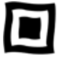 |
| sharp |  |
| curved |  |
| tik_tak_toe | 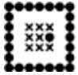 |
| octagonal | 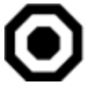 |
| alien |  |
| grid |  |
| square_diamond |  |
| thin_circle |  |

- *Modules* object:

| field | type | mandatory | description |  
| --- | --- | --- | --- |
| type | string | false | Type of Module (see table below) |

Please read the table below which illustrates the different options:

| Module type | Representation |
| --- | --- |
| simple | 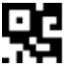 |
| rounded | 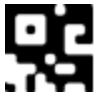 |
| rounded_light | 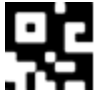 |
| rounded_strong |  |
| sieve | 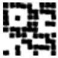 |
| angular | 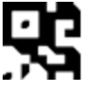 |
| paint | 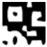 |
| dots | 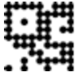 |
| arrows | 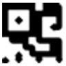 |
| styled | 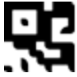 |
| rectangles | 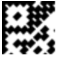 |
| tik_tak_toe | 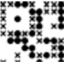 |
| connections | 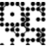 |
| shinny | 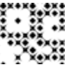 |
| diamonds |  |
| small_circles |  |

- *Background* object:

> Attention:   
> The overlay will apply an image on your QR Code, we recommend using a 300px by 300px image with a sufficient contrast against your background color or your QR Code my not be readable by native scanners

| field | type | mandatory | description |  
| --- | --- | --- | --- |
| url | string | false | The URL of your remote asset to use as overlay |
| brightness | float | false | From 0.0 to 1.0 (default 0.5), brightness will be applied on your asset |
| contrast | float | false | From 0.0 to 1.0 (default 0.5), contrast that will be applied on your asset |

- *Logo* object:

> Attention:  
> A logo is an image present in your QR Code that hides some information, thanks to our QR Code redundancy it should have no effect on the QR Code readability. But, a logo too big or misplaced can render your QR Code unreadable

| field | type | mandatory | description |  
| --- | --- | --- | --- |
| excavate | boolean | false | (default: false) To excavate or not the logo in the QR Code |
| x | number | false | Absolute origin position in pixels on the x axis in the QR Code |
| y | number | false | Absolute origin position in pixels on the y axis in the QR Code |
| x_norm | number | false | Normalized x position offset |
| y_norm | number | false | Normalized y position offset |
| width | number | false | Width in pixels of your logo |
| height | number | false | Height in pixels of your logo |
| url | string | false | The URL of your remote asset to use as logo |

- *Frame* object (optional):

> Frames add a decorative border with text around your QR Code. The frame is rendered server-side and included in the output image.

| field | type | mandatory | description |  
| --- | --- | --- | --- |
| style | string | true | Frame style (see list below) |
| text_top | string | false | Text displayed above the QR Code (supported by some styles) |
| text_bottom | string | false | Text displayed below the QR Code |
| background_color | string | false | Hexadecimal color for the frame (default: black) |

Available frame styles: `simple`, `beverage`, `banner`, `filled_card`, `callout_filled`, `callout_top`, `dashed_border`, `inline`, `scan`, `rounded`, `banner_ribbon`, `phone_scan`, `phone_screen`

Styles that support independent `text_top`: `simple`, `beverage`, `banner`, `filled_card`, `callout_top`, `dashed_border`. Other styles render a single text using `text_bottom`.

**Response**

Content-Type: image/png

The preview image of the resulted QR Code

**Response headers**

| header | description |
| --- | --- |
| X-Unitag-Generator | "CONTRAST_WARNING" if the QR Code colors may cause scan issues, "OK" otherwise |
| X-Unitag-Logo-Too-Big | "true" if the logo exceeds recommended size for scan readability |

---
### Create a QR Code

Create a QR Code for the profile of the API Key

**HTTP request**

`POST /qrcode`

**Request fields**

Example
```json
{
  "data": {
    "type": "url",
    "resolution": "dynamic",
    "url": "https://example.com/my-page",
    "label": "My first QR code"
  },
  "settings": {
    "layout": {
      "gradient_type": "",
      "type": "image_overlay",
      "color_background": "#ffffff",
      "force_shadow": "none"
    },
    "eyes": {
      "type": "simple"
    },
    "modules": {
      "type": "simple"
    },
    "background": {
      "url": "https://example.com/my-asset.png",
      "brightness": 0.5,
      "contrast": 0.5
    },
    "logo": {
      "excavate": false,
      "x": 0,
      "y": 0,
      "width": 20,
      "url": "https://example.com/my-logo.png"
    }
  }
}
```

Example of data payload with Dynamic Pro

```json
{
  "data": {
    "type": "url",
    "resolution": "dynamic-pro",
    "domain_id": "f81d4fae-7dec-11d0-a765-00a0c91e6bf6",
    "url": "https://example.com/my-page",
    "[...]": "[...]"
  }
}
```

Example of data payload with a Campaign associated to the QR code at its creation

```json
{
  "data": {
    "type": "url",
    "resolution": "dynamic",
    "url": "https://example.com/my-page",
    "label": "My first QR code",
    "campaign": {
      "uuid": "fd3180e2-e5e2-45ca-a8e5-b737627132bc"
    }
  },
  "settings": {
    "layout": {
      "gradient_type": "",
      "type": "image_overlay",
      "color_background": "#ffffff",
      "force_shadow": "none"
    },
    "eyes": {
      "type": "simple"
    },
    "modules": {
      "type": "simple"
    },
    "background": {
      "url": "https://example.com/my-asset.png",
      "brightness": 0.5,
      "contrast": 0.5
    },
    "logo": {
      "excavate": false,
      "x": 0,
      "y": 0,
      "width": 20,
      "url": "https://example.com/my-logo.png"
    }
  }
}
```

**Details**

*Data* object:

| field      | type | mandatory | description                                                     |  
|------------| --- | --- |-----------------------------------------------------------------|  
| type       | string | true | Type of QR Code, one of "url, vcard"                            |  
| resolution | string | true | Resolution of your QR Code, one of "dynamic, dynamic-pro, static" |
| domain_id  | string | false | Mandatory if resolution type is "dynamic-pro"                   | 
| url        | string | true | Final URL to which your QR Code should redirect to upon scanning |
| label      | string | false | Name for your QR code                                           |
| preferred_short_url | string | false | Custom short URL segment (alphanumeric, no special characters) |
| campaign   | object | false | Campaign to associate with the QR code (contains `uuid` field) |

*Settings* object:

For more details about the settings object please refer to the *Settings* object in the **QR Code Preview** section

**Response fields**

Example

```json
{
  "status": "created",
  "qrcode_id": "f81d4fae-7dec-11d0-a765-00a0c91e6bf6",
  "content_url": "https://qrcode.link/a/f81d4fae-7dec-11d0-a765-00a0c91e6bf6",
  "qr_code_image_url": "https://cdn-public.unitag.io/aaaaaaa-7dec-11d0-a765-00a0c91e6bf6/preview.png"
}
```

| field | type | description                                                                |
| --- | --- |----------------------------------------------------------------------------|
| status | string | Status of the QR Code, one of "created, updated"                           |
| qrcode_id | string | ID of the QR Code created                                                  |
| content_url | string | Resolution URL, your own domain name if resolution is set to "dynamic-pro" |
| qr_code_image_url | string | QR Code image available from our CDN                                       |

---

### Retrieve a QR Code

Retrieve a QR Code via its ID

**HTTP request**

```GET /qrcode/<qrcode_id>```

---

### Retrieve all QR Codes

Retrieve all QR Codes associated with the account

**HTTP request**

```GET /qrcodes/paginated?page=1&sortField=creation_date&sortOrder=desc&maxRows=5```

Above is request with default args.

Parameters:

- sortField [field to sort with, one of Label, Destination, Campaign, Organisation, creation_date, short_url]
- sortOrder [desc/asc]
- filterLabel [string, partial search allowed]
- filterDestination [string, partial search allowed]
- filterCampaign [campaign_uuid]
- filterOrganisation [organisation_uuid]
- filterDate [string, dd/mm/yyyy]
- filterType [string, type of QR code]
- filterShortUrl [string, partial search allowed]
- filterBatchId [batchID]
- maxRows [integer]

---

### Update a QR Code destination URL

Update the destination URL of a QR Code

> This request is only available for Dynamic and Dynamic Pro QR Codes

**HTTP request**

```PUT /qrcode/<qrcode_id>/url```

**Request fields**

Example 

```json
{
  "url": "https://unitag.io/features"
}
```

*Data* object:

| field | type | mandatory | description |  
| --- | --- | --- | --- |  
| url | string | true | The final URL of your QR Code |

---

### Update a QR Code label

Update the label (name) of a QR Code

**HTTP request**

```PUT /qrcode/<qrcode_id>/label```

**Request fields**

```json
{
  "label": "My updated QR code name"
}
```

| field | type | mandatory | description |  
| --- | --- | --- | --- |  
| label | string | true | The new label for your QR Code |

**Response**

```json
{
  "status": "updated"
}
```

---

### Delete a QR Code

Delete a QR Code

**HTTP request**

```DELETE /qrcode/<qr_code_uuid>```

---

### Download a QR Code

Download a QR Code in multiple formats

**HTTP request**

```
POST /asset/download/qrcode_bundle
```

**Request fields**

Example single download

```json
{
  "asset_uuid": "<qrcode_id>",
  "format": "png",
  "size": 300,
  "unit": "px"
}
```

Example with frame

```json
{
  "asset_uuid": "<qrcode_id>",
  "format": "png",
  "size": 300,
  "unit": "px",
  "hasFrame": true,
  "frame": {
    "style": "simple",
    "text_top": "",
    "text_bottom": "SCAN ME",
    "background_color": "#000000"
  }
}
```

| field | type | mandatory | description |  
| --- | --- | --- | --- |  
| asset_uuid | string | true | Asset ID to be downloaded |
| format | string | true | Desired output format, one of "png", "svg", "jpeg", "pdf" |
| size | number | true | Desired output size, range between 100 and 2500 |
| unit | string | true | Desired output unit, one of "px", "mm" |
| color_profile | string | false | One of "RGB" (default), "GRAYSCALE" |
| hasFrame | boolean | false | Whether to include a frame around the QR Code |
| frame | object | false | Frame settings (see Frame object in Preview section) |

**Response**

Binary output matching your request representing the image of your asset

---

### Download multiple QR Codes

```
POST /asset/download/export
```

Example batch download

```json
{
  "qrcode_ids": ["<qrcode_id_1>", "<qrcode_id_2>", "<qrcode_id_3>"],
  "format": "png",
  "size": 300,
  "unit": "px"
}
```

| field | type | mandatory | description |  
| --- | --- | --- | --- |  
| qrcode_ids | Array of string | true | Assets ID to be downloaded |
| format | string | true | Desired output format, one of "png", "svg", "jpeg", "pdf" |
| size | number | true | Desired output size, range between 100 and 2500 |
| unit | string | true | Desired output unit, one of "px", "mm" |
| color_profile | string | false | One of "RGB" (default), "GRAYSCALE" |
| hasFrame | boolean | false | Whether to include a frame around each QR Code |
| frame | object | false | Frame settings (see Frame object in Preview section) |

**Response**

A compressed archive (zip) containing all your assets

---

## Templates

Templates allow you to save and reuse QR Code designs.

### Retrieve QR Code templates

Retrieve the list of existing templates

**HTTP request**

```
GET /qrcodes/templates
```

**Response**

An array of template objects with their UUIDs, names, and associated design.

When creating a QR code using a template design, pass the UUID of the template to the POST create QR Code request:

```json
{
    "settings": {
        "redundancy": "H",
        "template_id": "c7a5dc7c-4bcb-435d-a5a3-b21658189f7a"
    },
    "data": {
        "type": "url",
        "resolution": "dynamic",
        "url": "https://example.com"
    }
}
```

---

### Create a template from a QR Code

Save a QR Code's design as a reusable template

**HTTP request**

```POST /qrcode/<qrcode_id>/template```

**Request fields**

```json
{
  "template_name": "My template"
}
```

| field | type | mandatory | description |
| --- | --- | --- | --- |
| template_name | string | true | Name for the template |

**Response**

```json
{
  "template_id": "c7a5dc7c-4bcb-435d-a5a3-b21658189f7a"
}
```

---

### Update a template

Update the name of an existing template

**HTTP request**

```PUT /qrcodes/template/<template_id>```

**Request fields**

```json
{
  "name": "Updated template name"
}
```

**Response**

```json
{
  "status": "updated",
  "uuid": "c7a5dc7c-4bcb-435d-a5a3-b21658189f7a",
  "name": "Updated template name"
}
```

---

### Delete a template

**HTTP request**

```DELETE /qrcodes/template/<template_id>```

---

## Filters

> NB: Filters are only available for Dynamic and Dynamic Pro QR Codes

Filters are a way to redirect your users based on certain conditions. Those conditions are evaluated upon scanning a QR Code. If those conditions are fulfilled the filter will be triggered

Filters available:
* Language based
* Device based
* Location based (module required)
* Time based (module required)
* Combination of all the above

### Create a Filter

**HTTP request**

```POST /qrcode/<qrcode_id>/filter```

**Request fields**

Example

In this example we are creating a language filter which is read as followed:
If an english speaker scans this QR Code it will be redirected to https://www.unitag.io/welcome

```json
{
  "final_url": "https://www.unitag.io/welcome",
  "statements": [
    {
      "type": "language",
      "value": "en"
    }
  ]
}
```

**Details**

*Filter* object:

| field      | type               | mandatory | description                                                     |  
|------------|--------------------| --- |-----------------------------------------------------------------|  
| final_url  | string             | true | The destination URL used if the filter statements are fulfilled |
| statements | Array of Statement | true | List of Statements for the filter                               | 

*Statement* object:

| field | type | mandatory | description                                                                            |  
|-------| --- | --- |----------------------------------------------------------------------------------------|  
| type  | string | true | Type of Statement, one of "device, language, location_country, location_precise, time" |  
| value | string | true | Refer to next paragraph for formats specifications |                       

**Statement values format**

*device type Statement*

Supported values: "blackberry", "iphone", "ipad", "windows_phone",
"windows_tablet", "windows_computer", "apple_computer", "android_phone", "android_tablet"

```json
{
  "type": "device",
  "value": "iphone"
}
```

*language type Statement*

Supported values: Any Alpha-2 code part of ISO 639 -- [Wikipedia Source](https://en.wikipedia.org/wiki/ISO_639-1)

```json
{
  "type": "language",
  "value": "en"
}
```

*location_country type Statement*

Supported values: Any Alpha-2 code part of ISO 3166 -- [ISO Search](https://www.iso.org/obp/ui/#search/code/)

```json
{
  "type": "location_country",
  "value": "US"
}
```

---

### Retrieve filters for a QR Code

**HTTP request**

```GET /qrcode/<qrcode_id>/filters```

---

### Update a filter

Update an existing filter's statements and/or destination URL

**HTTP request**

```PUT /qrcode/<qrcode_id>/filter/<filter_id>```

**Request fields**

```json
{
  "final_url": "https://www.unitag.io/updated-page",
  "statements": [
    {
      "type": "language",
      "value": "fr"
    }
  ]
}
```

**Response**

```json
{
  "filter_id": "f81d4fae-7dec-11d0-a765-00a0c91e6bf6",
  "final_url": "https://www.unitag.io/updated-page",
  "status": "updated"
}
```

---

### Delete a filter

**HTTP request**

```DELETE /qrcode/<qrcode_id>/filter/<filter_id>```

**Response**

```json
{
  "status": "deleted",
  "filter_id": "f81d4fae-7dec-11d0-a765-00a0c91e6bf6"
}
```

---

## Domain Names

Domain names allows to use your own domain name in your QR code for Dynamic Pro QR codes

> NB: Custom domain names are available from Gold subscription and upwards

### Register a domain name

Registering a domain name is the first operation in order to use your custom domain name with Unitag Resolver engine

Supported domain names examples:
* APEX (eg: example.org)
* SUBDOMAIN (eg: **qr**.example.org, **www**.example.org, **foo**.example.org)

**Request**

```POST /domains```

Example

```json
{
  "domain_name": "example.org"
}
```

*Data* object:

| field | type | mandatory | description |  
| --- | --- | --- | --- |  
| domain_name | string | true | Domain name that you want to register with us|


**Response**

```json
{
  "type": "APEX",
  "requested_domain": "example.org",
  "domain_uuid": "f81d4fae-7dec-11d0-a765-00a0c91e6bf6",
  "fqdn": "f81d4fae-7dec-11d0-a765-00a0c91e6bf6.qrcode.link",
  "ip": "1.2.3.4"
}
```

*Data* object:

| field | type  | description |  
| --- | --- | --- |  
| type | string | Either APEX or SUBDOMAIN based on the given domain |
| requested_domain | string | The domain you have submitted |
| domain_uuid | string | The UUID of your domain |
| fqdn | string | If SUBDOMAIN - Fully Qualified Domain Name - For registration purposes |
| ip | string | If APEX - IP address - For registration purposes |

Once you have received the response from the API you need to update your domain name with your registrar

If your domain name is an APEX you will need to create an A record such as:  
```example.org A 1.2.3.4```

If your domain name is a SUBDOMAIN you will need to create a CNAME record such as:   
```foo.example.org CNAME f81d4fae-7dec-11d0-a765-00a0c91e6bf6.qrcode.link.```

> NB: If you are registering a SUBDOMAIN please make sure to add a dot (.) at the end of the CNAME entry

---

### Validate a domain name

Once your domain has been registered with us you need to update your domain with your registrar (eg: Gandi, Google, OVH). Once done you will be able to finalize the registration of your domain by validating your configuration against our API

**Request**

```GET /domains/<domain_id>/check```

**Response**

HTTP code 200

```json
{
  "domain_uuid": "f81d4fae-7dec-11d0-a765-00a0c91e6bf6"
}
```

HTTP code 409

```json
{
  "message": "The current entry does not resolves to a Unitag domain name, please make sure your DNS zone is correctly configured"
}
```

---

### List all domain names available

Retrieve the list of domain available for the account

**Request**

```GET /domains```

**Response**

HTTP code 200

NB: As an owner of a domain name more fields might be added if you have shared the domain across accounts

```json
[
  {
    "domain_id": "f81d4fae-7dec-11d0-a765-00a0c91e6bf6",
    "domain_name": "example.org",
    "ssl_activated": true,
    "activated": true,
    "status": ""
  }  
]
```

*Data* []object:

| field         | type  | description                    |  
|---------------| --- |--------------------------------|  
| domain_id     | string | The ID of the domain           |
| domain_name   | string | The domain name as string      |
| ssl_activated | boolean | Status of the SSL service      |
| activated     | boolean | Status of the domain name      |
| status        | string | Used for deactivation purposes |

---

## Campaigns

The campaigns endpoint allows you to work around the campaign management tool, helping you to sort your QR codes.

### List campaigns

Retrieve the list of created campaigns and sub-campaigns

**Request**
```GET /campaigns```

**Response**
```json
[
    {
        "uuid": "c2bd62df-3642-4a93-9754-aa68f65c6622",
        "name": "HEALTHCHECK",
        "color": "#673ab7",
        "creation_date": "2021-02-23T22:31:29.32Z",
        "sub_campaigns": [
            {
                "uuid": "0f877077-ac95-4e4c-b3af-5ad4fb8c1655",
                "name": "health1",
                "color": "orange",
                "creation_date": "2021-02-23T22:31:29.32Z",
                "sub_campaigns": null
            }
        ]
    },
    {
        "uuid": "a88dc890-015f-4e93-8640-a65fd66646a6",
        "name": "CAMPAIGN 1",
        "color": "#2196f3",
        "creation_date": "2021-02-24T13:51:35.127Z",
        "sub_campaigns": null
    }
]
```

---

### Create a campaign

**Request**

```POST /qrcodes/campaign```

```json
{"name": "New Campaign", "color": "blue"}
```

| field | type | mandatory | description |
| --- | --- | --- | --- |
| name | string | true | Name for the campaign |
| color | string | true | Color for the campaign (hex color or predefined: purple, red, blue, green, orange, yellow) |

**Response**

```json
{
  "uuid": "fd3180e2-e5e2-45ca-a8e5-b737627132bc",
  "name": "New Campaign",
  "color": "blue",
  "creation_date": "2023-05-26T12:39:52.921Z"
}
```

---

### Create a sub-campaign

**Request**

```POST /qrcodes/campaign```

Pass the `uuid` of the parent campaign:

```json
{"uuid": "fd3180e2-e5e2-45ca-a8e5-b737627132bc", "name": "Sub Campaign", "color": "yellow"}
```

---

### Update a campaign

**Request**

```PUT /campaigns/<campaign_id>```

```json
{"name": "Updated Campaign Name", "color": "#f44336"}
```

**Response**

```json
{
  "uuid": "fd3180e2-e5e2-45ca-a8e5-b737627132bc",
  "name": "Updated Campaign Name",
  "color": "#f44336"
}
```

---

### Get campaign assets count

Retrieve the number of QR codes associated with a campaign

**Request**

```GET /campaigns/<campaign_id>/assets_count```

**Response**

```json
{
  "id": "fd3180e2-e5e2-45ca-a8e5-b737627132bc",
  "count": 42
}
```

---

### Delete a campaign

Deleting a campaign will also delete all sub-campaigns, if any.

**Request**

```DELETE /campaigns/<campaign_uuid>```

**Response**

```json
{"id": "fd3180e2-e5e2-45ca-a8e5-b737627132bc", "status": "deleted"}
```

---

## Analytics

The Analytics endpoint allows you to retrieve stats generated by your QR Codes

### Retrieve QR codes aggregated stats

Unitag pre aggregates data in order to offload calculations for you

**Request**

```POST /analytics/qrcodes/search```

Example

The following query reads as:
* Get all stats from 2 weeks ago to now (type: 1 relate to a relative time search )

```json
{
  "time_range": {
    "type": 1,
    "number": 2,
    "unit": "weeks"
  }
}
```

* Get all stats for an absolute date range (type 0)

```json
{
  "time_range": {
    "type": 0,
    "start_date": "2022-07-31T23:00:00.000Z",
    "end_date": "2022-09-01T23:00:00.000Z"
  }
}
```

* Get all stats for specifics qrcodes 

```json
{
    "filters": [
        {
            "field": "QR Codes",
            "operator": "",
            "value": [
                "6b8e573e-f5ca-4402-b300-3641ee9484c0",
                "b229d8bc-92f6-4d88-a9d4-6e8adc7187ef"
            ]
        }
    ],
    "time_range": {
        "type": 1,
        "number": 2,
        "unit": "weeks"
    }
}
```

*Data* object:

| field | type | mandatory | description |  
| --- | --- | --- | --- |  
| time_range.type | number | true | 0 for absolute date range, 1 for relative |
| time_range.number | number | false | Time observed (number), required if type is 1 |
| time_range.unit | string | false | Time observed (units) - one of: minutes, hours, days, weeks, months. Required if type is 1 |
| time_range.start_date | string | false | ISO 8601 date, required if type is 0 |
| time_range.end_date | string | false | ISO 8601 date, required if type is 0 |
| filters | array | false | Array of filter objects to narrow results |
| filters[].field | string | false | "QR Codes" to filter by specific QR code UUIDs |
| filters[].value | array | false | Array of QR code UUIDs |


**Response**
```json
{
  "histogram": [
    {
      "date": 1635984000000,
      "count": 0
    },
    {
      "date": 1637193600000,
      "count": 1
    }
  ],
  "visits_count": 1,
  "visits_count_comparison": 0,
  "unique_visitors_count": 1,
  "unique_visitors_count_comparison": 0,
  "countries_histogram": [
    {
      "country_iso": "GB",
      "count": 1
    }
  ],
  "visits_history": {
    "cursor_id": "",
    "visits": [
      {
        "date": 1637251153589,
        "label": "My QR code",
        "country_iso": "GB",
        "model": "iPhone"
      }
    ]
  }
}
```

---

### Retrieve visit records

Retrieve detailed visit records for your QR Codes

**Request**

```POST /analytics/qrcodes/search/visit-records```

Uses the same request body format as the aggregated stats endpoint above.

**Response**

```json
{
  "visits_history": {
    "cursor_id": "",
    "visits": [
      {
        "date": 1637251153589,
        "label": "My QR code",
        "country_iso": "GB",
        "city_iso": "London",
        "model": "iPhone"
      }
    ]
  }
}
```

---

### Export analytics

Export analytics data as an Excel spreadsheet

**Request**

```POST /analytics/qrcodes/export```

Uses the same request body format as the aggregated stats endpoint. Add `time_zone` to localize dates in the export.

```json
{
  "time_range": {
    "type": 1,
    "number": 4,
    "unit": "weeks"
  },
  "time_zone": "Europe/Paris"
}
```

**Response**

Binary file (Excel .xlsx spreadsheet)
